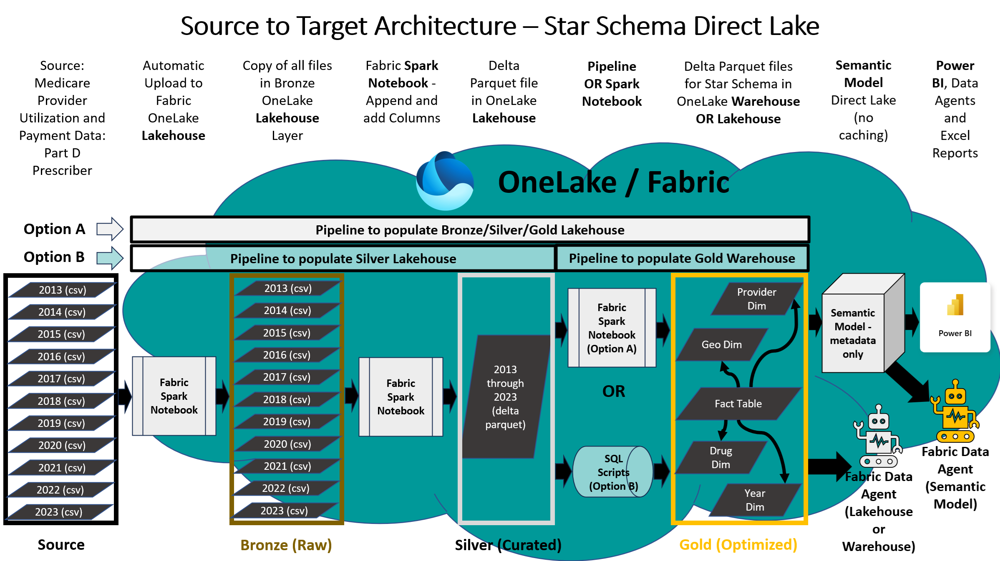

# **Power BI Direct Lake Connector with 275M+ Healthcare Records**

## 🚀 Overview

This solution demonstrates the capabilities of **Microsoft Fabric** using over **275 million rows** of real-world healthcare data. It showcases how to leverage the **Power BI Direct Lake connector** to query large datasets stored in Delta Parquet format—**without caching or a relational database**. **Fabric Data Agents** have also been added for the **Semantic Model** and the **Lakeouse or Warehouse**. The **Semantic Model** is also optimized for Power BI Copilot, including the standalone version that functions as a SaaS MCP server for chatting on all of your content and data.

The dataset used is the publicly available [Medicare Part D Prescribers - by Provider and Drug](https://data.cms.gov/provider-summary-by-type-of-service/medicare-part-d-prescribers/medicare-part-d-prescribers-by-provider-and-drug), sourced from the Centers for Medicare & Medicaid Services (CMS).

> 🎥 **Watch the full demo**: YouTube Video https://youtu.be/2tLIGVZ4c8E

---

### Update March 2026 - Exploration of Agentic AI development for Power BI Semantic Models

Power BI Semantic Model for the solution was created manually, step by step instructions are documented in the Manual Setup section and it was automated using code for Quick Setup. With recent advancements in Agent AI, Agentic AI based development was explored for Power BI Semantic Model using Visual Studio Code and Power BI Modeling MCP Server.  The learnings have been shared as part of the following blog and YouTube video demo:
- **Blog**: [Agentic AI development for Power BI Semantic Models using GitHub Copilot and Power BI Modeling MCP Server](https://medium.com/@isinghrana/agentic-development-for-power-bi-semantic-models-using-github-copilot-and-power-bi-modeling-mcp-0d1ec2efc6c4)
- **YouTube Video**: [Demo Video](https://youtu.be/EKOG86ynOn0) 

---

## 🏗️ Architecture

The solution follows the **Medallion Architecture**:

- **Bronze Layer**: Raw CSV files downloaded from CMS
- **Silver Layer**: Cleaned and flattened Delta Parquet tables
- **Gold Layer**: Star schema tables optimized for Power BI reporting and Power BI Copilot

Additionally, it integrates **Fabric Data Agents** enabling **Generative AI-powered natural language queries**.

---

## 🧠 What You'll Learn

This demo provides hands-on experience with:

- **Data engineering** using Fabric Spark and Data Pipelines
- **Power BI Direct Lake Mode** for querying large-scale data
- **Medallion Lakehouse Architecture** (Bronze → Silver → Gold)
- **Natural Language querying** using **Fabric Data Agents** and **Power BI Copilot**

---

## ⚙️ Setup Options

### ✅ Option 1: Quick Setup (Automated)

Ideal for a fast setup with minimal effort. You can run a single Notebook and it will install an end-to-end Fabric medaalion architecture with 275M rows of data for testing, demos and evaluation purposes. The Quick Setup will install everything including the Lakehouse Data Agent, but the Semantic Model Data Agent will need to be added manually. Currently the AI Instructions for the Semantic Model Data Agent require large semantic model storage format (a Workspace setting), and are still in Public Preview. We may add these instructions and the Semantic Model Data Agent to the Quick Setup once everything is generally available.

Run a single notebook to set up the full environment with following components deployed:

- Lakehouse
- Notebooks
- Data Factory Pipeline
- Semantic Model (optimized for Power BI Copilot and Fabric Data Agents)
- Power BI Report
- Data Agent for Lakehouse

📘 **Setup Guide**: [`quick-setup.md`](./quick-setup.md)

> ⏱️ Requires less than 5 minutes to setup the installation Notebook, followed by approximately 20–45 minutes for a non-interactive Data Factory pipeline to load data. 

> ⚠️ Note: This method currently uses the Lakehouse for all layers (including Gold).

---

### 🛠️ Option 2: Manual Setup (Step-by-Step)

Ideal for hands-on learning and deeper understanding of Microsoft Fabric and Power BI.

Follow the step-by-step instructions to manually set up the solution components:

- **Lakehouse or Warehouse, Notebooks and Data Pipeline** (Warehouse for Gold Layer is an option available in manual setup only) ,this step takes approximately **10–15 minutes**
- **Data Factory pipeline** runs non-interactively to load data which takes about **20–45 minutes**
- **Semantic Model** creation requires additional manual effort and is the most time-intensive part
- A **Power BI report template** is already included to help accelerate report building
- **Fabric Data Agents** for the Lakehouse, Warehouse, and Semantic Model

📘 **Setup Guide**: [`manual-setup.md`](./manual-setup.md)

> ⏱️ **Total setup time**: ~30–60 minutes depending on experience  
> 💡 **Recommended for**: Users who want to explore the architecture and learn by doing or Users who want to try the Fabric Warehouse

---

